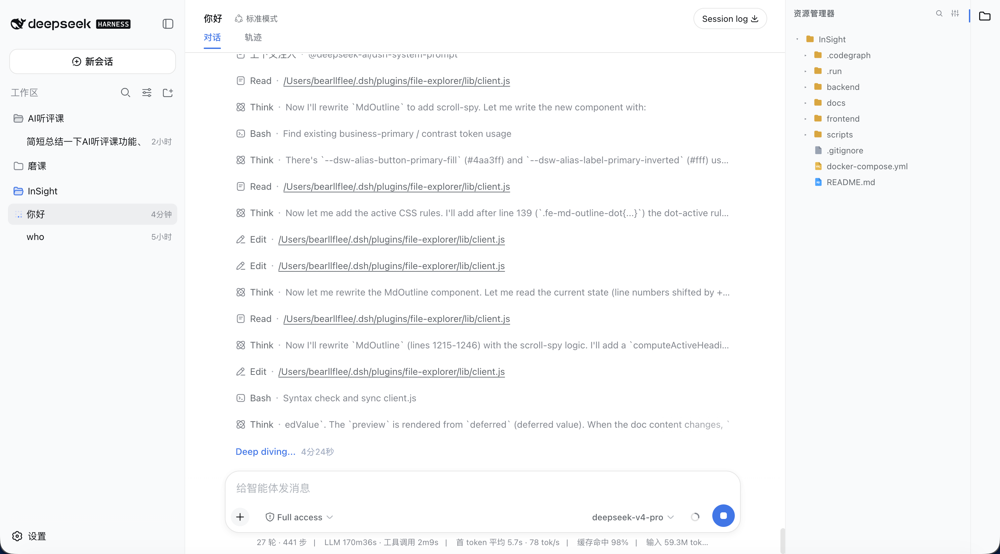
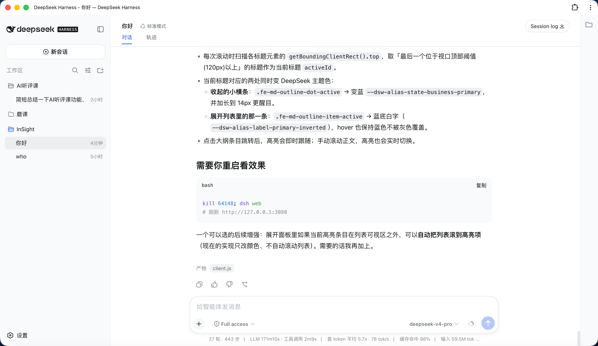
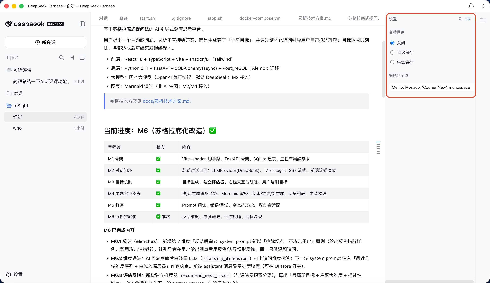
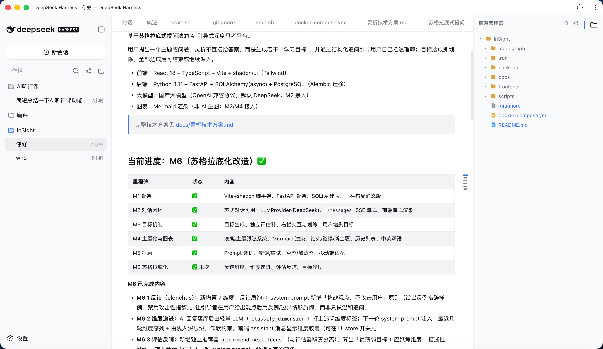
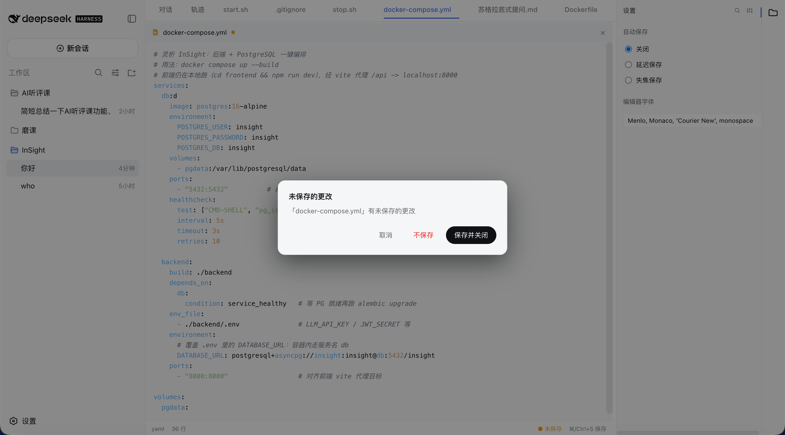

# dsh-plugin-file-explorer

[English](README.md) | 中文

给 [DeepSeek Harness (DSH)](https://www.deepseek.com) Web 界面加一个 VS Code 风格的工作区文件浏览器：右侧文件树 + 可编辑标签页 + Markdown 阅读/编辑/分屏 + 悬浮大纲 + Quick Open 搜索。

## 功能

- **文件树**：右侧资源管理器，按类型着色图标，可折叠目录，点击在中心区打开文件。
- **右键菜单**：文件树右键 → 新建文件 / 新建文件夹 / 重命名 / 删除 / 复制路径（类 VS Code 资源管理器）。
- **拖拽移动**：把文件或文件夹拖到目标文件夹即可移动（类 VS Code）；移动已打开的文件时标签页自动同步路径。
- **从系统导入**：粘贴在访达 / Windows 资源管理器里复制的文件（`⌘/Ctrl+V`），或从桌面直接拖入——文件夹保留结构，重名自动改名。
- **可编辑标签页**：中心区标签页（位于「对话 / 轨迹」之后），支持语法高亮、Tab 缩进、`⌘/Ctrl+S` 保存、悬停 `×` 关闭、右键菜单（关闭 / 关闭其他 / 关闭右侧 / 关闭已保存 / 全部关闭 / 复制路径 / 固定）。
- **自动保存**：可配置「关闭 / 延迟保存 / 失焦保存」，关闭未保存文件时弹确认框。
- **Markdown**：Typora/Obsidian 式「阅读 / 编辑 / 分屏」三模式；阅读模式右侧悬浮大纲，鼠标悬停展开（类似 ChatGPT 悬浮条）。
- **Quick Open**：`⌘/Ctrl+P` 按文件名模糊搜索并打开文件（与 VS Code 一致），也可点侧栏放大镜按钮进入。
- **多语言**：跟随 DSH 通用设置自动切换中文 / 英文。
- **编辑器字体**：设置面板可自定义打开文件的编辑器字体（等宽上下文）。
- **聊天文件在插件内打开**：点击聊天里的文件（任务产物 chip、正文行内路径、工具卡片文件链接）会直接在资源管理器编辑器标签页打开，而不再跳到浏览器 / 访达。

## 效果

**资源管理器展开效果**



**资源管理器收起效果**



**文件设置**



**文件搜索**


**打开文件**



**markdown大纲**


**关闭未保存文件**



## 安装

> 需要已安装 DSH 并初始化过 `web` profile（首次运行 `dsh web` 会自动生成）。

`dsh plugin` 是 DSH 内置的插件管理命令，会把参数转发给 profile 目录里的 pnpm。**请始终用它，不要用 `npm install -g`**——DSH 从 `$DSH_HOME/profiles/web/node_modules` 加载插件，全局目录（Windows 的 `AppData\Roaming\npm`）DSH 根本不读取，装了也不会生效。

> 前提：`dsh plugin` 底层调用 pnpm，请先装好 pnpm（`npm install -g pnpm`），否则会报 `pnpm not found on PATH`。

### 方式一：从 npm 安装

```bash
# 安装到 web profile（等价于在该 profile 目录执行 pnpm add）
dsh plugin --profile web add dsh-plugin-file-explorer
```

### 方式二：从 GitHub 安装（无需发布 npm）

```bash
dsh plugin --profile web add github:bearllfleed/dsh-plugin-file-explorer
```

### 更新

```bash
dsh plugin --profile web update dsh-plugin-file-explorer
```

### 卸载

```bash
dsh plugin --profile web remove dsh-plugin-file-explorer
```

### 查看已装版本 / 线上版本

```bash
# 实际加载的版本（在 profile 里查）
dsh plugin --profile web list dsh-plugin-file-explorer
# npm 线上最新版
npm view dsh-plugin-file-explorer version
```

### 然后启用插件

安装只把包放进依赖，还需要在 profile 的 `cordis.patch.yml` 里登记，DSH 才会加载它。编辑
`$DSH_HOME/profiles/web/cordis.patch.yml`，加入：

```yaml
- insert:
    - id: file-explorer
      name: 'dsh-plugin-file-explorer'
```

`id` 是配置树中的唯一标识（可自定义），`name` 必须是 npm 包名。

### 重启

```bash
dsh web
# 然后刷新 http://127.0.0.1:3080
```

> 安装 / 更新后必须**彻底退出并重启 `dsh web` 进程**（宿主路由在启动时注册），并用 `⌘/Ctrl+Shift+R` 硬刷新页面（浏览器 bundle 会被缓存）。光刷新页面看不到新功能。

### 更新后功能没生效？

按顺序排查：

1. **没完全重启 DSH** —— 新建 / 重命名 / 删除等宿主路由是进程启动时注册的，重装后必须退出 `dsh web` 再重启，而不是只刷新页面。
2. **浏览器缓存** —— 右键菜单、拖拽在浏览器 bundle 里，用硬刷新或开无痕窗口。
3. **装错位置 / 版本不对** —— `dsh plugin --profile web list dsh-plugin-file-explorer` 查实际加载的版本；如果显示旧版，多半是当初用 `npm install -g` 装到了全局目录（DSH 不读），重新跑一遍上面的 `dsh plugin --profile web add ...`。

## 使用

| 操作 | 快捷键 / 入口 |
|---|---|
| 打开 / 关闭文件树 | 右侧活动栏文件图标 |
| 打开文件 | 文件树点击；或 `⌘/Ctrl+P` 搜索后回车 |
| 新建 / 重命名 / 删除 | 文件树右键菜单 |
| 移动文件 / 文件夹 | 拖到目标文件夹 |
| 保存 | `⌘/Ctrl+S` |
| 关闭标签页 | 标签页悬停 `×`，或右键菜单 |
| Markdown 模式 | 文件顶部「阅读 / 编辑 / 分屏」 |
| Markdown 大纲 | 阅读模式右侧悬浮条，悬停展开 |
| 编辑器字体 / 自动保存 | 侧栏齿轮设置按钮 |

## 目录结构

```
lib/index.js    宿主侧（Node）路由：list / read / raw / write / create / rename / delete / files
lib/client.js   浏览器侧 bundle：文件树、编辑器、Markdown、大纲、Quick Open
package.json    插件清单（dsh.client.inject / platform）
```

## 开发

改完 `lib/` 后，若插件通过 `file:` 链接安装，直接同步到
`$DSH_HOME/profiles/web/node_modules/dsh-plugin-file-explorer/lib/` 即可；否则重新 `dsh plugin add` 并重启。

## License

[MIT](LICENSE)
